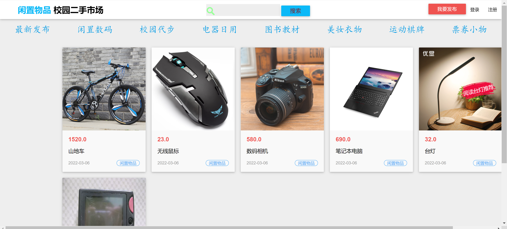
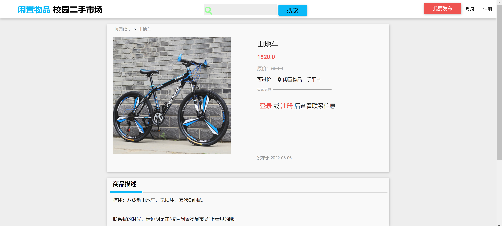
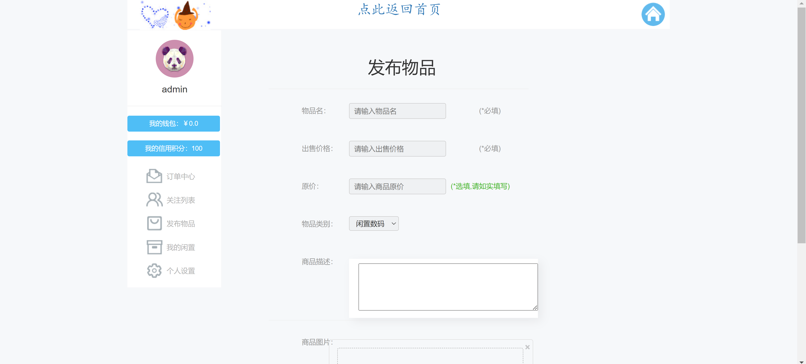
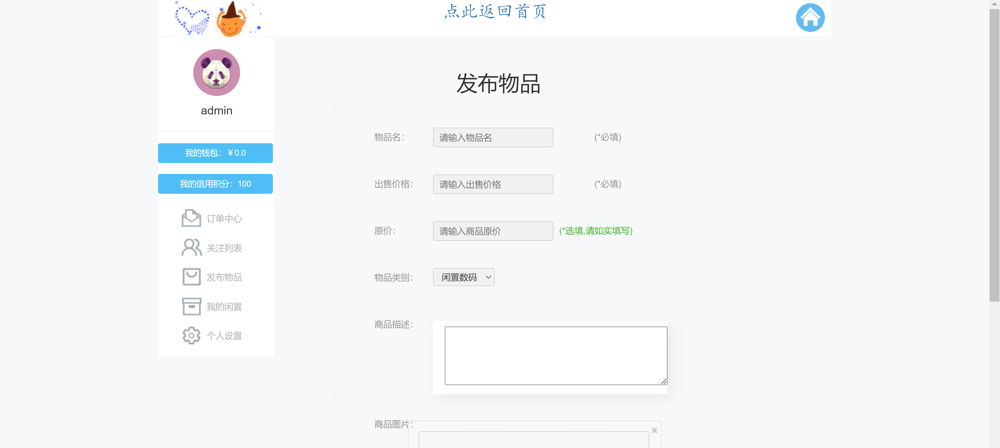
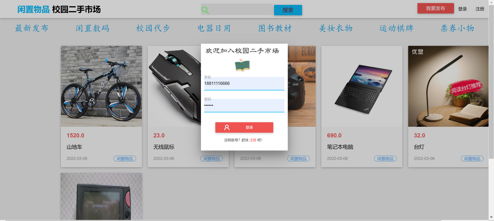
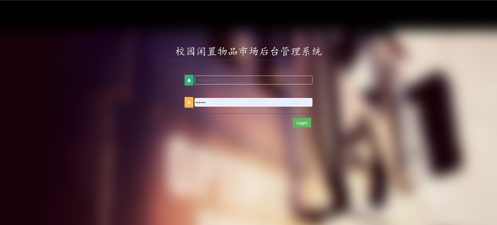
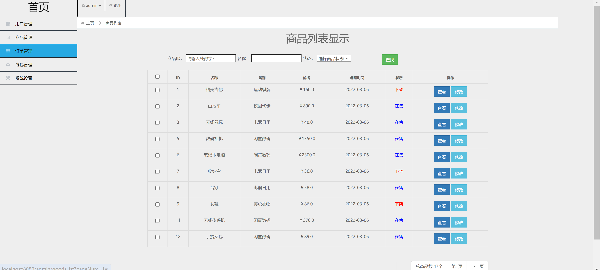
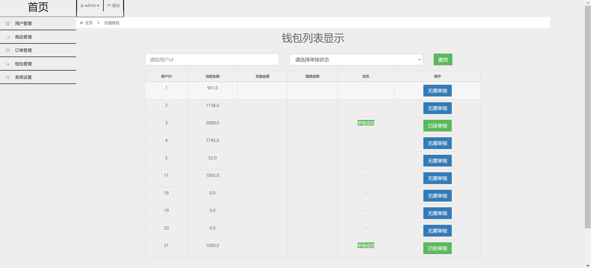

<h1 align="center">校园闲置二手物品管理系统</h1>

## 简介
校园闲置二手物品管理系统：角色分为管理员、用户；功能包括用户管理、商品管理、订单管理、钱包管理、系统设置、物品发布、交易管理、财务操作。    --计算机毕业设计源码；毕设源码；java毕业设计源码

## 联系方式

<h3 align="center">获取完整代码与数据库文件 + 微信：deepguan QQ: 86050149 QQ群: 783742310</h3>

<h3 align="center">可帮忙远程部署 包运行成功！提供远程部署、修改代码、设计文档指导、代码讲解等服务！</h3>

## 功能介绍（完整见运行截图）
管理员：管理用户信息、商品信息、订单、钱包及系统设置，审核用户财务信息，操作商品状态，提供用户登录及不同权限的功能导航，确保系统安全和高效运行。

用户：注册登录后可发布、浏览、搜索二手物品，查看交易记录和财富积分，通过界面功能块管理个人闲置物品，参与安全的物品交易，提升资源利用效率。

## 运行截图

本代码来源于网络,仅供学习参考使用!

